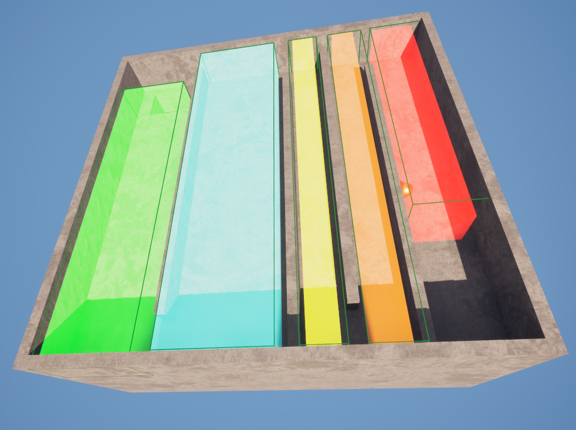
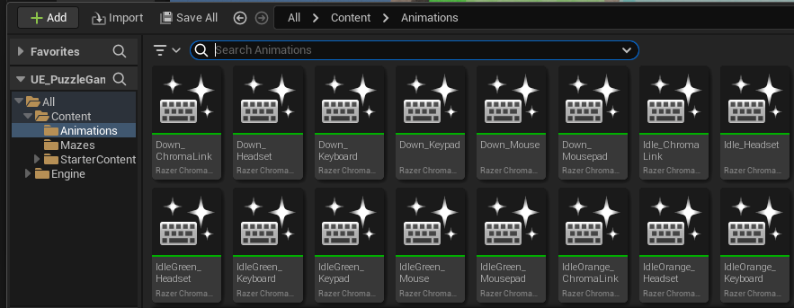
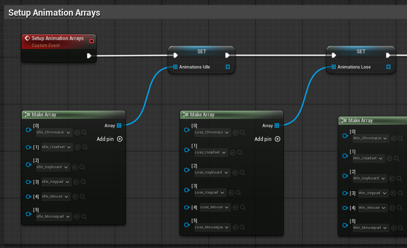
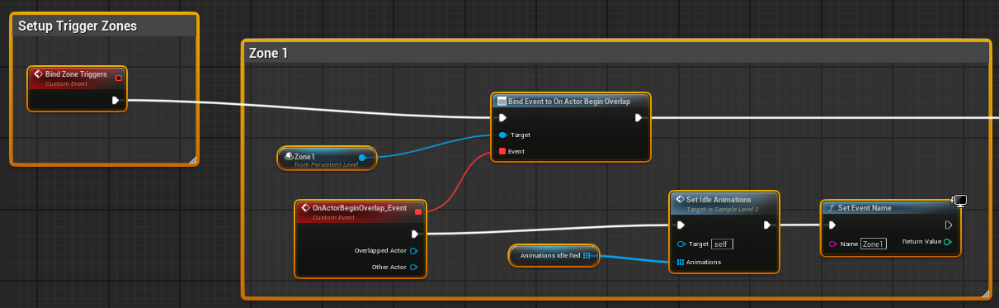
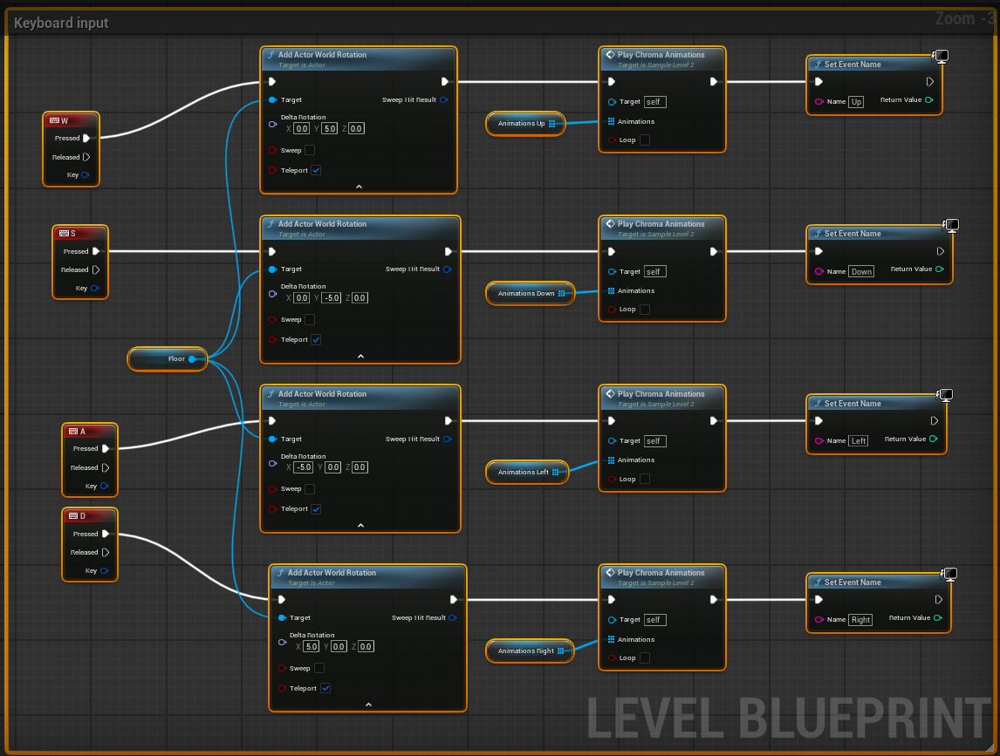
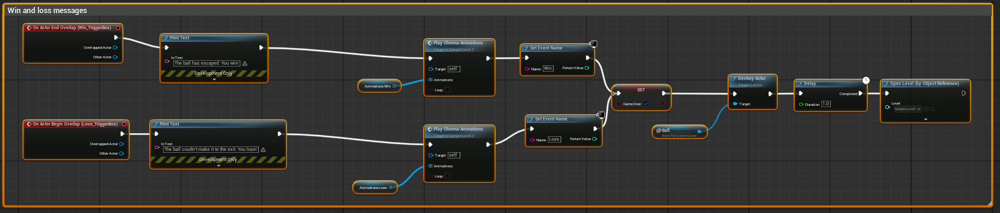
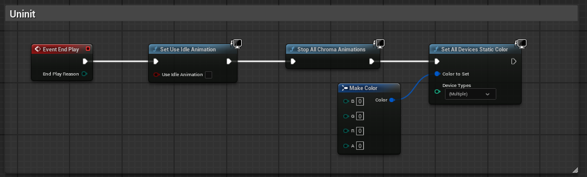
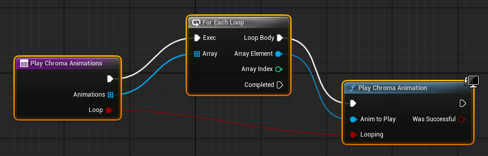
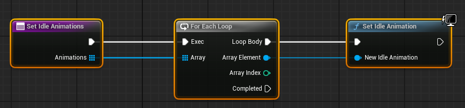

# UE Puzzle Game

A simple puzzle game made with `UE 5.5` that uses the built-in [RazerChromaDevices Plugin](https://github.com/EpicGames-Mirror-A/UnrealEngine/blob/ue5-main/Engine/Plugins/Experimental/RazerChromaDevices/RazerChromaDevices.uplugin) for RGB Lighting and Haptics.

**Screenshot**

**Chroma animation assets**

**Create variable arrays of Chroma assets**

**Trigger zones change the idle animations**

**Keyboard input triggers Chroma animations**

**Win and loss triggers**

**Uninitialization**

**Helper function: Play Chroma Animations using an array of animations**

**Helper function: Set idle animations using an array of Chroma animations**

