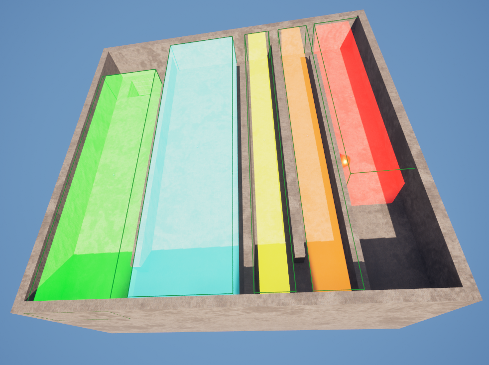
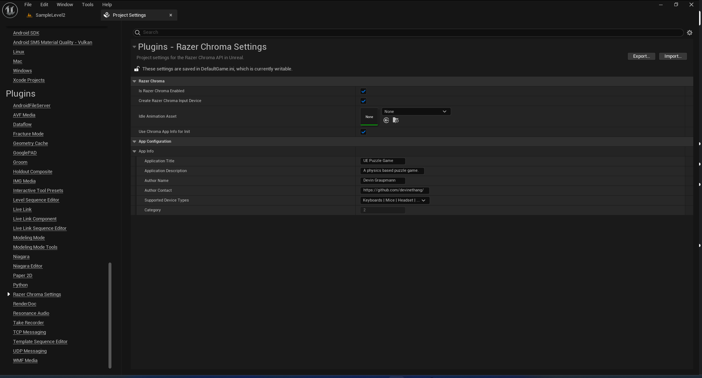
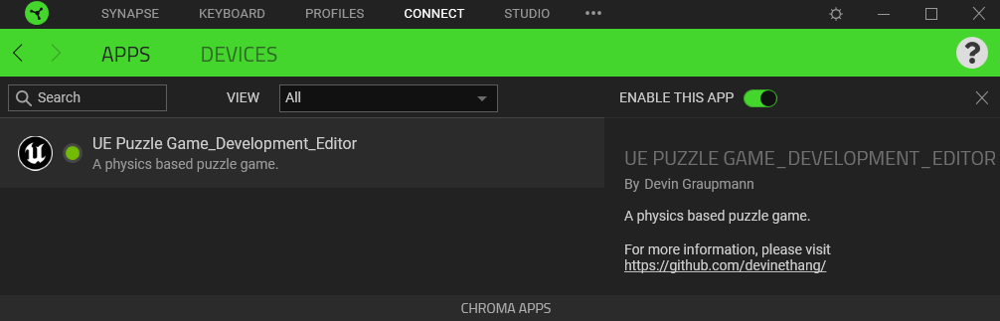
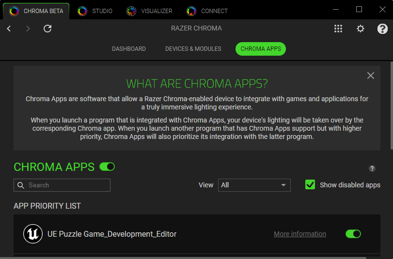
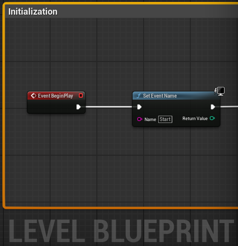
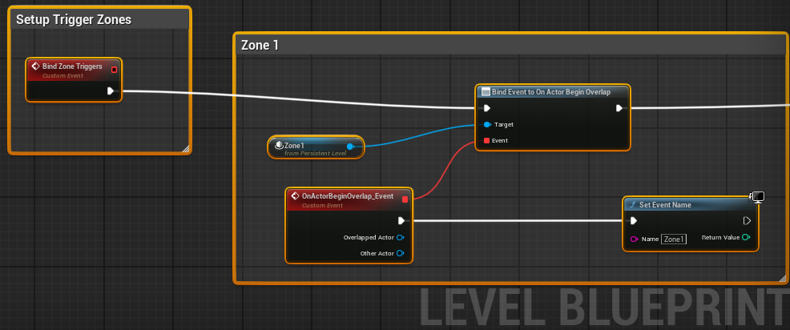
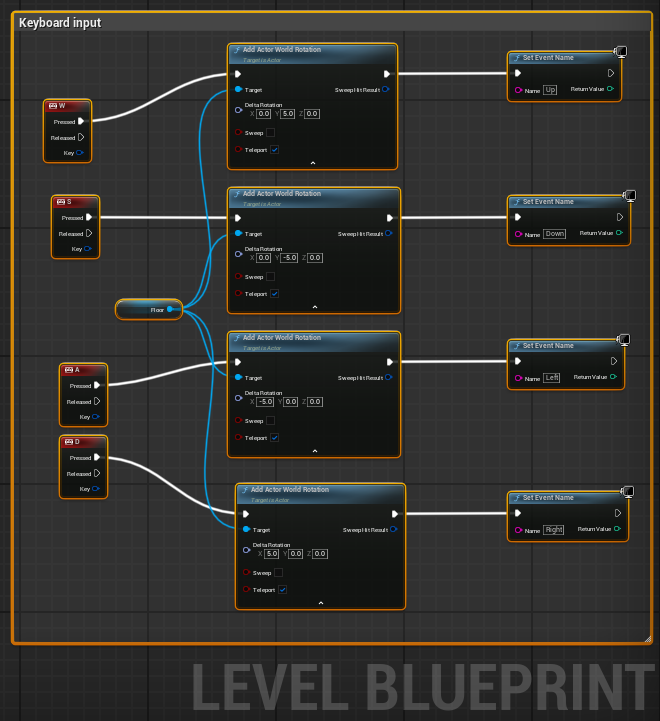
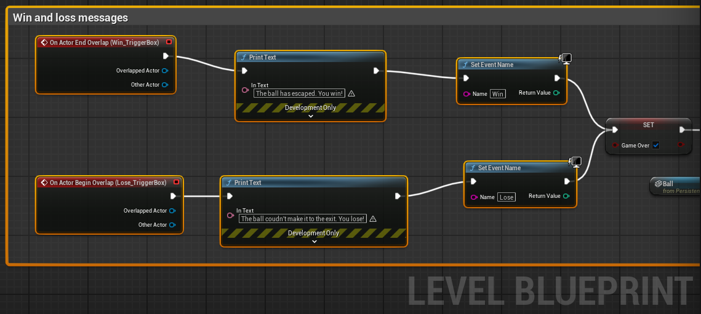

# UE Puzzle Game

A simple puzzle game made with `UE 5.5` that uses the built-in [RazerChromaDevices Plugin](https://github.com/EpicGames-Mirror-A/UnrealEngine/blob/ue5-main/Engine/Plugins/Experimental/RazerChromaDevices/RazerChromaDevices.uplugin) for RGB Lighting and Haptics.

* Reference: Udemy Course - [Unreal Engine Blueprint Game Developer](https://www.udemy.com/share/101Xs63@qmXgHYO3Q319DCjejAcAtWUSpHuj7xBejevWzBVnZ1i73ttn7Un28wWbyDkzLUWp/) - The first project in the course builds a maze puzzle game with Unreal blueprints.

**Screenshot**

**Project settings**

**AppInfo displays in `Synapse`**

**AppInfo displays in the `Chroma App`**

**Initialization sets idle animation with external Chroma**

**Trigger zones change the idle animations through external Chroma**

**Keyboard input triggers external Chroma animations**

**Win and loss triggers**

